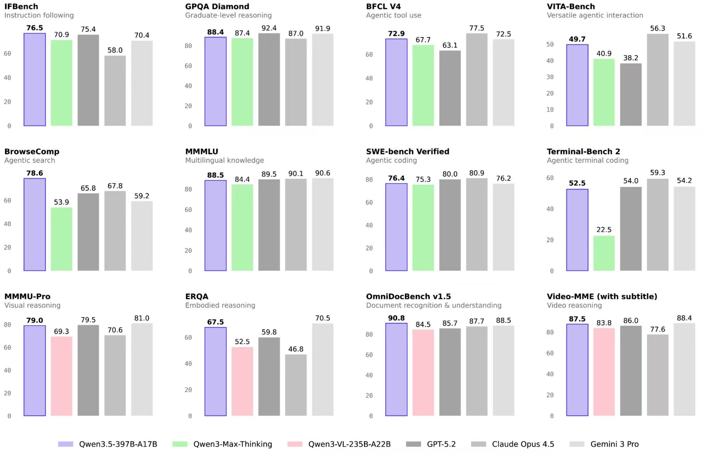
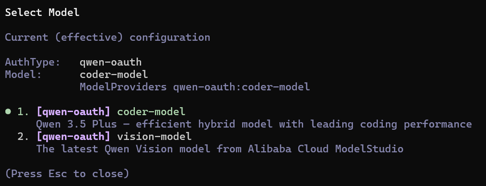

# 🤖 Qwen Code OAuth Plugin for OpenCode 

> **Enhanced Version** - Added request throttling, 429 handling, header alignment and other enhancements based on [opencode-qwencode-auth](https://github.com/gustavodiasdev/opencode-qwencode-auth)


---
中文文档见--[README.zh.md](README.zh.md)
---
## ✨ Use Qwen's Latest and Most Powerful Model Qwen3.5 Plus on Your OpenCode!



## 📋 Quick Start

### 1. Install Plugin

```bash
cd ~/.config/opencode && npm install github:RunMintOn/OpenCode-Qwen-Proxy
```

### Upgrade from Older Versions (Fastest)

```bash
cd ~/.config/opencode
npm uninstall opencode-qwen-proxy
npm install github:RunMintOn/OpenCode-Qwen-Proxy#v1.0.2
```

Then fully restart OpenCode.

### 2. Enable Plugin

Edit `~/.config/opencode/opencode.jsonc`:

```json
{
  "plugin": ["opencode-qwen-proxy"],
  "provider": {
    "qwen-code": {
      "npm": "@ai-sdk/openai-compatible",
      "name": "Qwen Code",
      "options": {
        "baseURL": "https://portal.qwen.ai/v1"
      },
      "models": {
        "coder-model": {
          "name": "Qwen Coder",
          "limit": { "context": 1048576, "output": 65536 },
          "modalities": { "input": ["text"], "output": ["text"] }
        },
        "vision-model": {
          "name": "Qwen Vision",
          "limit": { "context": 131072, "output": 32768 },
          "modalities": { "input": ["text", "image"], "output": ["text"] },
          "attachment": true
        }
      }
    }
  }
}
```

### 3. Login Authentication

```bash
opencode auth login
```

Then repeatedly press "↓" and select **"Other"** → Enter `qwen-code` → Select **"Qwen Code (qwen.ai OAuth)"**

Browser will open automatically, log in to qwen.ai and authorize.

### 4. Select Model

```bash
opencode models
```

You should see `qwen-code/coder-model` and `qwen-code/vision-model` in the list.

---

## ✨ Core Features

### Basic Features
- 🔐 **OAuth Device Flow** - Standard authentication flow based on RFC 8628
- 🆓 **1000 times/day Free** - No API Key, no credit card required
- 🔄 **Auto Token Refresh** - Automatically renews before expiration
- 🔗 **Credential Sharing** - Shares `~/.qwen/oauth_creds.json` with Qwen Code CLI

### Enhanced Features (This Version)
- ⏱️ **Request Throttling** - Control 1 time/second, avoid hitting 60 times/minute limit
- 📡 **429 Auto Retry** - Automatically wait and retry when rate limited
- 🎲 **Request Jitter** - 0.5-1.5s random delay, avoid fixed patterns
- 🏷️ **Header Alignment** - Exactly matching headers with qwen-code CLI

---

## 🎯 Available Models

> **Important**: Qwen OAuth only supports 2 models, fully aligned with qwen-code CLI.

| Model | Context | Max Output | Description |
|------|---------|------------|-------------|
| `coder-model` | 1M tokens | 64K tokens | Code model (default, recommended) |
| `vision-model` | 128K tokens | 32K tokens | Vision model |

### Usage Examples

```bash
# Use code model (recommended)
opencode --provider qwen-code --model coder-model

# Use vision model
opencode --provider qwen-code --model vision-model
```

> **Note**: 
>**According to qwen code description, coder-model is the newly released qwen 3.5 plus**


---

## 📊 Usage Limits

| Plan | Rate Limit | Daily Limit |
|------|------------|-------------|
| Free (OAuth) | 60 times/minute | 1000 times/day |

> Limits reset at 0:00 Beijing Time next day. For higher limits, use [DashScope API](https://dashscope.aliyun.com).

---

## ⚙️ How the Plugin Works

### Overall Flow

```
┌─────────────────────────────────────────────────────────────────┐
│                        User Input Question                       │
└─────────────────────────────────────────────────────────────────┘
                              │
                              ▼
┌─────────────────────────────────────────────────────────────────┐
│                      OpenCode CLI                                │
│  ┌────────────────────────────────────────────────────────────┐ │
│  │  Load Plugin                                                │ │
│  │   ├─ loader: Returns apiKey + fetch function                │ │
│  │   └─ methods: Handles OAuth authentication                  │ │
│  └────────────────────────────────────────────────────────────┘ │
└─────────────────────────────────────────────────────────────────┘
                              │
                              ▼
┌─────────────────────────────────────────────────────────────────┐
│                    Plugin fetch Interceptor                      │
│  ┌──────────────────────────────────────────────────────────┐   │
│  │ 1. Add Headers                                            │   │
│  │    - User-Agent: QwenCode/0.10.3 (linux; x64)           │   │
│  │    - X-DashScope-CacheControl: enable                     │   │
│  │    - X-DashScope-AuthType: qwen-oauth                    │   │
│  │ 2. Add Authorization: Bearer <token>                      │   │
│  │ 3. Request Throttling (1 second interval + jitter)       │   │
│  │ 4. 429 Handling (wait and retry)                          │   │
│  └──────────────────────────────────────────────────────────┘   │
└─────────────────────────────────────────────────────────────────┘
                              │
                              ▼
┌─────────────────────────────────────────────────────────────────┐
│                    portal.qwen.ai/v1                             │
└─────────────────────────────────────────────────────────────────┘
```

### Three Roles of the Plugin

| Role | Function | Purpose |
|------|----------|---------|
| **Auth Provider** | `loader` | Returns config (apiKey + baseURL + fetch) |
| **Request Interceptor** | `fetch` | Intercepts all requests, adds headers + throttling |
| **OAuth Entry** | `methods` | Handles user login, gets access token |

---

## 🔬 Design Details

### 1. Request Throttling

**Problem**: OpenCode generates more requests than Qwen Code CLI, easily hitting 60 times/minute limit.

**Solution**: Request queue controls rate.

```typescript
class RequestQueue {
  private lastRequestTime = 0;
  private readonly MIN_INTERVAL = 1000; // 1 second

  async enqueue<T>(fn: () => Promise<T>): Promise<T> {
    const elapsed = Date.now() - this.lastRequestTime;
    const waitTime = Math.max(0, this.MIN_INTERVAL - elapsed);
    
    if (waitTime > 0) {
      await new Promise(resolve => setTimeout(resolve, waitTime));
    }
    
    this.lastRequestTime = Date.now();
    return fn();
  }
}
```

**Effect**: Ensures each request interval ≥ 1 second, won't exceed 60 times/minute.

---

### 2. Request Jitter

**Problem**: Fixed interval requests may be identified as "abnormal user".

**Solution**: Add 0.5-1.5s random delay on top of 1 second.

```typescript
// src/plugin/request-queue.ts
private readonly JITTER_MIN = 500;
private readonly JITTER_MAX = 1500;

private getJitter(): number {
  return Math.random() * (this.JITTER_MAX - this.JITTER_MIN) + this.JITTER_MIN;
}
```

**Effect**: Request interval = 1 second + (0.5~1.5s random) = 1.5-2.5s random, more like real user behavior.

---

### 3. Header Alignment

**Problem**: Server may identify client source through Headers.

**Solution**: Simulate qwen-code CLI Headers.

```typescript
headers.set('User-Agent', `QwenCode/0.10.3 (${platform}; ${arch})`);
headers.set('X-DashScope-CacheControl', 'enable');
headers.set('X-DashScope-UserAgent', `QwenCode/0.10.3 (${platform}; ${arch})`);
headers.set('X-DashScope-AuthType', 'qwen-oauth`);
```

**Effect**: From Headers perspective, requests are indistinguishable from qwen-code CLI.

---

### 4. 429 Error Handling

**Problem**: Even with throttling, occasional rate limiting may still occur.

**Solution**: Automatically wait and retry.

```typescript
if (response.status === 429) {
  const retryAfter = response.headers.get('Retry-After') || '60';
  await sleep(parseInt(retryAfter) * 1000);
  return fetch(input, { headers }); // Retry
}
```

**Effect**: Automatically recovers from rate limiting without user intervention.

---

## ✨ Enhanced Features

| Feature | Description |
|---------|-------------|
| ⏱️ Request Throttling | 1 second interval + 0.5-1.5s random jitter, avoid hitting 60 times/minute limit |
| 📡 429 Auto Retry | Automatically wait and retry when rate limited |
| 🏷️ Header Alignment | User-Agent, X-DashScope-* exactly matching qwen-code CLI |
| 💾 Token Cache | No refresh within 5 minutes, reduce extra requests |
| 🎯 Streamlined Models | Only supports 2 models (coder-model, vision-model), aligned with qwen-code CLI |

---

## 🔧 Troubleshooting

### Token Expiration

Plugin automatically refreshes Token. If issues persist:

```bash
# Delete old credentials
rm ~/.qwen/oauth_creds.json

# Re-authenticate
opencode auth login
```

### Frequent 429 Errors

- Check if multiple OpenCode instances are running simultaneously
- Wait for quota reset (0:00 Beijing Time)

### Plugin Not Showing

In `opencode auth login`:
1. Select **"Other"**
2. Enter `qwen-code`

---

## 🛠️ Local Development

### Method 1: Use npm link (Recommended)

**Step 1: Clone Project**

```bash
git clone https://github.com/RunMintOn/OpenCode-Qwen-Proxy.git
cd OpenCode-Qwen-Proxy
```

**Step 2: Install Dependencies**

```bash
npm install
```

**Step 3: Link Plugin**

```bash
# Run link in plugin project directory
npm link
```

**Step 4: Configure in OpenCode**

```bash
# Enter OpenCode config directory
cd ~/.config/opencode

# If package.json already exists, just add dependency
npm install opencode-qwen-proxy --save

# If no package.json, initialize first
npm init -y
npm install opencode-qwen-proxy --save
```

**Step 5: Verify Plugin Loaded**

```bash
# Restart OpenCode or start new conversation
opencode --version
```

---

### Method 2: Use file: Protocol (For Specific Version)

**Step 1-3: Same as above**

```bash
# Clone project and install dependencies
git clone https://github.com/RunMintOn/OpenCode-Qwen-Proxy.git
cd OpenCode-Qwen-Proxy
npm install
```

**Step 4: Build Plugin First**

```bash
# Build plugin (must build first)
npm run build
```

> Note: `file:` protocol needs to point to directory containing `package.json`, so build must run first.

**Step 5: Configure Local Link**

Edit `~/.config/opencode/package.json`:

```json
{
  "dependencies": {
    "opencode-qwen-proxy": "file:/path/to/OpenCode-Qwen-Proxy"
  }
}
```

> Replace `/path/to/OpenCode-Qwen-Proxy` with actual absolute path, for example:
> - Linux/Mac: `file:/home/username/OpenCode-Qwen-Proxy`
> - Windows: `file:C:/Users/username/OpenCode-Qwen-Proxy`

**Step 6: Install Dependencies**

```bash
cd ~/.config/opencode && npm install
```

---

### Development Mode (Recommended)

During development, use watch mode for auto-reload:

```bash
# In plugin project directory
npm run dev
```

This will auto-rebuild when code changes, convenient for real-time debugging.

---

### Build Commands Explanation

| Command | Description |
|---------|-------------|
| `npm run build` | Build production version to `dist/` directory |
| `npm run dev` | Development mode, watch files and auto rebuild |
| `npm run typecheck` | TypeScript type checking |

---

### Debugging Tips

**1. Enable Debug Logs**

```bash
# Temporarily enable debug logs
OPENCODE_QWEN_DEBUG=1 opencode ...
```

**2. View Plugin Logs**

Plugin outputs debug information when debug mode is enabled, helps troubleshooting.

**3. Check Credentials**

```bash
# View credential file location
cat ~/.qwen/oauth_creds.json
```

---

### FAQ

**Q: Do I need to reinstall after modifying code?**

> A: Using `npm link` - no; Using `file:` protocol - yes, need to reinstall after code changes (or use `npm run dev` auto-build then restart OpenCode).

**Q: How to confirm plugin is loaded?**

> A: In OpenCode, execute `opencode auth login`, if you can see "Qwen Code (qwen.ai OAuth)" option, plugin is loaded correctly.

**Q: What to do if problems occur?**

> A:
> 1. Confirm `"plugin": ["opencode-qwen-proxy"]` is added in `~/.config/opencode/opencode.jsonc`
> 2. Run `npm run typecheck` to check for syntax errors
> 3. Check console output for error messages

---

## 📁 Project Structure

```
opencode-qwen-proxy/
├── src/
│   ├── index.ts              # Plugin entry (loader + fetch + methods)
│   ├── constants.ts          # OAuth endpoints, model configuration
│   ├── types.ts              # TypeScript types
│   ├── qwen/
│   │   └── oauth.ts          # OAuth Device Flow + PKCE
│   └── plugin/
│       ├── request-queue.ts  # Request queue + throttling
│       └── auth.ts           # Credential management
├── package.json
└── README.md
```

---

## 🔗 Related Projects

- **[opencode-qwencode-auth](https://github.com/gustavodiasdev/opencode-qwencode-auth)** - Base of this project
- [qwen-code](https://github.com/QwenLM/qwen-code) - Official Qwen Code CLI
- [OpenCode](https://opencode.ai) - AI Programming Assistant CLI
- [opencode-antigravity-auth](https://github.com/NoeFabris/opencode-antigravity-auth) - Google OAuth reference implementation


---

## 📄 License

MIT

---

<p align="center">
  Enhanced from <a href="https://github.com/gustavodiasdev/opencode-wencode-auth">opencode-wencode-auth</a>
</p>
